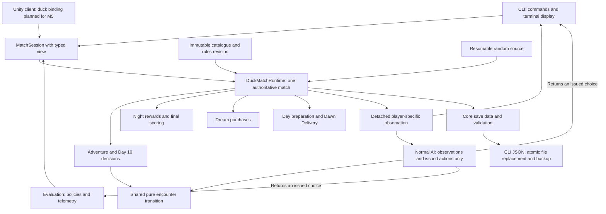

# Quackies codebase map

This is the working structure after M4.5 and the CLI usability checkpoint,
before M5 Unity integration. Use [the CLI guide](CLI_GUIDE.md) to play and
[ARCHITECTURE.md](ARCHITECTURE.md) for the detailed contracts. The current duck
game and the retained classic reference share a session boundary; they do not
share currencies or pretend to have the same rules.

## Repository structure

```text
Quackies.sln
├── src/
│   ├── Quackies.Core/                    Rules library: netstandard2.1
│   │   ├── Match/                       Shared session/actions + classic runtime
│   │   ├── Ducks/
│   │   │   ├── Definitions/             Board, chips, shop, events, settings
│   │   │   ├── Runtime/                 State, observations and Day/Night handlers
│   │   │   ├── AI/                      Normal policy and bounded planning
│   │   │   └── Persistence/             Serializer-neutral save data/validation
│   │   ├── Randomness/                  Random sources, portable resumable PCG
│   │   ├── AI/, Bags/, Cauldrons/, ...  Retained classic game implementation
│   │   └── Game/                        Older compatibility prototype
│   └── Quackies.Cli/                     Terminal client: net10.0
├── tests/Quackies.Core.Tests/            xUnit rules, policies, saves, CLI tests
├── tools/
│   ├── Quackies.Evaluation/              Real-Core complete-game evaluation
│   ├── analyze-duck-evaluation.py        Aggregates and uncertainty from telemetry
│   ├── tests/                           Analyzer tests
│   ├── sync-unity-core.sh               Explicit compiled-DLL handoff to Unity
│   └── validation/                      Recorded classic Unity checks
├── unity/Quackies.Unity/                 Separate Unity project, artwork and scenes
└── docs/
    ├── CLI_GUIDE.md                      Player/command instructions
    ├── CODEBASE_MAP.md                   This map and navigation guide
    ├── ARCHITECTURE.md                   Boundary and extension contracts
    ├── HANDOFF.md / PROGRESS.md          Current handoff and historical checkpoints
    └── duck-migration/                  Current rules, data, art, plan and evidence
```

The solution contains Core, CLI, tests and Evaluation. Unity is opened separately.
CLI and Evaluation reference the Core project directly. Unity consumes a
compiled Core DLL under `Assets/Plugins`, so rebuilding the solution does not
update Unity automatically. M5 owns that handoff and the new duck runtime views.

## How the pieces fit



The dotted Unity connection is planned work. The existing playable Unity scene
uses the classic profile; the accepted duck layout is still a fixed-data proof.

## One action, from keypress to screen

1. The CLI asks `GetSnapshot(playerId)` for a detached `DuckMatchView`. It
   contains public match state plus only that duck's permitted private data.
2. `GetLegalActions(playerId)` gets actions from the profile runtime. The shared
   session issues copies with internal match, player, revision and action-window
   authorization.
3. The player chooses a displayed number. The CLI submits that exact issued
   `GameAction` to `Execute`; it does not manufacture an action from its label.
4. The session rejects foreign, repeated or stale commands and checks current
   legality again. `DuckMatchRuntime` dispatches to the appropriate handler.
5. Core resolves the whole action, including any automatic phase transition,
   and returns a fresh view. The CLI saves the completed state, paces the AI
   when appropriate, and renders the next prompt.

Action IDs are opaque. Another duck's action does not automatically invalidate
an otherwise legal command, but Day, phase and final-Day decision-window changes
can. Read-only CLI commands stay inside the current prompt: they do not execute
Core actions, advance the AI or consume random numbers.

## Where the duck rules live

| Type or area | Responsibility |
| --- | --- |
| `DuckRules` / `DuckRuleDefinitions` | Immutable board, encounter, shop and event catalogues; selects supported rules revisions |
| `DuckMatchState` | Mutable state owned inside Core; never exposed to front ends |
| `DuckMatchRuntime` | Profile orchestration, legal actions and observations |
| `DuckAdventureHandler` | Ordinary adventure actions and final-Day commitment/reveal handling |
| `DuckAdventureRules` | Pure chip transition shared by live play and AI planning |
| `DuckNightResolver` | Collective conditions, rewards, frozen Sleep, Most Rested and final outcomes |
| `DuckDreamHandler` | Purchase legality, spending, per-type restrictions and nest capacity |
| `DuckDayPreparation` | New-Day setup, events, bag shuffle, Goose insertion, trail and Dawn Delivery |
| `DuckMatchView` / `DuckPlayerView` | Detached observations: public state, own composition and permitted preview |
| `DuckNormalPolicy` | Chooses among issued actions using bounded planning and complete shopping bundles |
| `DuckSaves` / `DuckSaveData` | Capture, validate and restore exact authoritative state |

Core is authoritative. The canonical board/shop JSON in
`docs/duck-migration/v1` is a checked specification, not a second live rules
engine loaded by the CLI. Definition tests detect drift between it and Core.
Descriptions in a client explain rules; they must not calculate their outcomes.

New matches use rules revision 2. Revision 1 saves select the original prices.
Clients must display and plan purchases from the running match's
`DuckMatchView.ShopOffers`, not a hardcoded current-price table. `DuckRules.V1`
names the current catalogue of the v1 product profile; it is not a promise that
every restored match uses rules revision 1.

## AI and evaluation

Normal receives a `DuckMatchView` and issued legal actions, never the runtime,
RNG, saved bag order or opponent's preview. It can reason about its remaining
bag composition and its own legitimate Signpost preview. The pure encounter
transition keeps its simulated outcomes consistent with live rules.

The planner has a bounded search budget and heuristic purchase valuation; it
is not an optimal solver. The evaluation runner drives the same public session
API, recording complete seeded games and actual issued actions. Diagnostic
buying policies are test opponents, not extra player-selectable rulesets.
The [M4.5 report](duck-migration/m4-5/REPORT.md) records comparisons and limits.

## Save and Continue flow

`DuckSaves.Capture` copies state, physical chip identities, exact bag/event order,
resumable PCG state, pending commitments and command revisions into a detached
DTO. Core validates its invariants without depending on JSON or file APIs.

`DuckSaveStore` in the CLI serializes that DTO, writes and flushes a temporary
file next to the destination, then replaces the primary save. A valid previous
action is retained as `.bak`. A corrupt primary cannot replace a good backup.

Restore validates the DTO and reconstructs the exact runtime without replaying
actions or drawing new randomness. It creates a fresh command scope, so actions
issued before restoration cannot be submitted to the restored session. The
rules revision is retained, including prices and already-spent Sleep.

The save file is private host state. It must never be passed to AI policies or
rendered as a normal player observation. Future Unity save handling should reuse
Core's capture/restore contract while owning its own host storage/lifecycle.

## Shared code versus the classic reference

The shared boundary is `MatchSession<TView>`, its internal `IMatchRuntime<TView>`
interface and issued `GameAction` authorization. The nongeneric `MatchSession`
is the classic compatibility facade; `MatchSession.CreateDuck` constructs the
typed duck session.

The `Match` folder also contains classic phase handlers and `ClassicMatchRuntime`.
The old `AI`, `Bags`, `Cauldrons`, `Players`, `Rewards`, `Rounds`, `Rules` and
`Tokens` areas mostly serve that reference profile. Do not extend those classic
handlers to implement a new duck chip. The older `Game/QuackiesGame` compatibility
prototype is not the current match engine.

Two boundaries remain deliberate maintenance debt: generic session persistence
has an internal duck-runtime bridge, and `GameAction` carries fields for both
profiles. The shared folder also contains classic-specific types. Changing these
now would touch tested action authorization and save behavior without improving
CLI play. Keep their responsibilities explicit; revisit them in a separate
compatibility cleanup with focused tests.

## How to make the next change

| You want to change… | Start here | Verify with… |
| --- | --- | --- |
| A CLI command, wording or layout | `src/Quackies.Cli` | CLI integration tests and an interactive session |
| An encounter power | Duck definitions and shared adventure transition | Encounter, planning and Night interaction tests |
| Rewards, shop costs or World Events | Duck definitions/runtime and canonical specification | Definition alignment, rules, policy and save-version tests |
| AI choices | Duck AI; retain public observation boundary | Deterministic decision tests and declared evaluation comparisons |
| Saved state | Duck persistence/runtime and host save store | Roundtrips, mid-action-window Continue and legacy fixtures |
| Unity interaction or art | Unity presenter/view/editor code in M5 | Binding checks, full connected match and rendered/device checks |

Keep rule changes separate from presentation changes. Run focused checks while
working, then full regressions at a coherent checkpoint. Git checkpoints use
`codex/duck-game-milestone-0`; Core source, tests and Unity changes are separate
commits. The lead owns commits/pushes and coordinates Editor mutations.

```sh
dotnet build Quackies.sln --configuration Release
dotnet test Quackies.sln --configuration Release
```

No Unity DLL sync, scene rebuild or export is implied by those commands.

## CLI file responsibilities

| File in `src/Quackies.Cli` | Responsibility |
| --- | --- |
| `Program.cs` / `CliEntry.cs` | Thin entry point, help and explicit profile routing; ducks is the default |
| `DuckCliOptions.cs` | Duck launch options, save selection and fixed/fresh seed choice |
| `DuckCli.cs` | Start or restore a match, route interactive/demo modes, report host errors |
| `DuckInteractiveCli.cs` | Input loop, read-only commands, issued-action submission and AI pacing |
| `DuckCliRenderer.cs` | Status, board, bag, shop, Night, history and final-result displays |
| `DuckReferenceText.cs` | Display-only descriptions of encounter powers and World Events |
| `DuckCliDemos.cs` | Bounded scripted daily-cycle and Normal-versus-Normal demonstrations |
| `DuckSaveStore.cs` | JSON, atomic local save replacement and validated backup recovery |
| `ClassicCli.cs` | Retained nine-round reference client |

This checkpoint separates input scheduling from rendering instead of expanding
one large loop. Informational commands leave scheduling paused at the same
decision; a successful game action permits the next AI step. No new rules
engine, framework or serialization layer was introduced.
