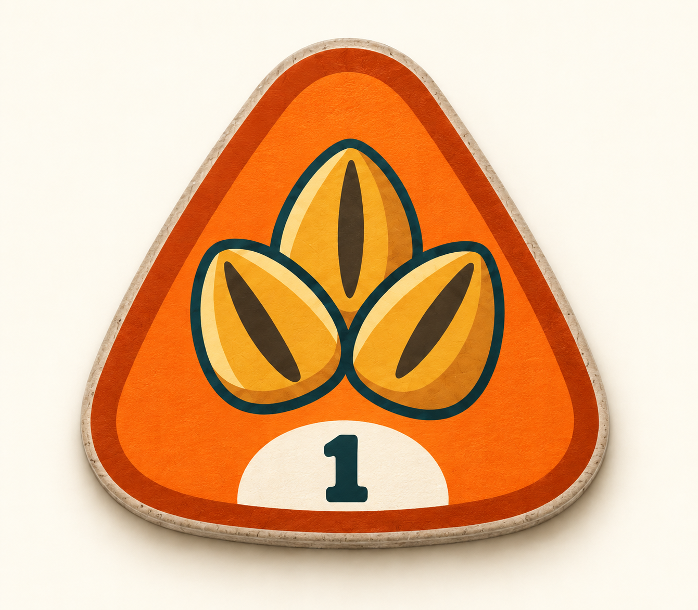
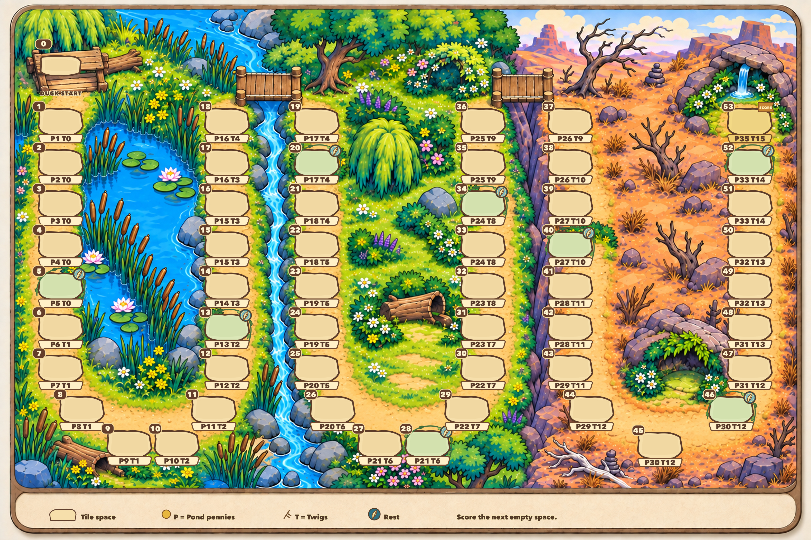

# V3 — clear tile spaces, rewards and eight rests

This is an image review outside Unity. The user approved the V2 duck tiles and
three-biome style, requested one stronger-coloured seed shape and an exact
labelled board, and selected eight rests by rounding half of 15 ruby spaces up.
The later approval permits precise typesetting over the generated artwork.

## Seed tile

One rounded triangular silhouette identifies seeds. A solid orange face and
thick darker orange rim carry the category colour, with golden seed art and a
separate cream strength-1 area. The approved duck artwork is unchanged.

## Board

The illustrated route has a separate duck start 0 and numbered spaces 1–53.
Every numbered pad has an empty tile well and an attached reward strip. **P**
means Pond pennies; **T** means Twigs. The strip remains outside the tile's
central placement area. Decorative scenery and the connecting trail do not add
extra numbered spaces.

Eight leafy frames and attached feather markers assign rests to exact spaces:
**5,13,20,28,34,40,46,52**. These are existing ruby indices, distributed 2/3/3
across the pond, meadow and wasteland. Their illustrated positions await review.
The printed Penny/Twig amounts remain exactly the current track values; the
previous proposed biome reward curve is deferred.

The current game scores the **next empty space**. Encounter placement ends at 52,
and 53 is its final scoring space, rather than an additional encounter placement.
The image's smaller set of rest markers does not change Core's 15 ruby flags.
No new rules, Unity import, scene build or device test is included here.

## Reproduction and verification

The clean background and seed came from the built-in `image_gen.imagegen` tool.
The first fully generated labelled board contained skipped/mislabelled positions
and incorrect rewards, so it is excluded from the final deliverables. Following
explicit user approval, [render-board.mjs](render-board.mjs) renders a static
SVG overlay from [layout.json](layout.json) and the audited
[track-data.json](track-data.json), then exports the combined image with Sharp.
The review copy is a 3072 × 2048 JPEG at quality 98 with 4:4:4 chroma sampling.
Use `--output three-biome-board-v3.png` to reproduce a lossless PNG.

Run `node render-board.mjs` from this folder with Sharp available to Node.
`node render-board.mjs --check` validates the layout without exporting the image.
The local bundled Node runtime and packages were used for this review.

All checks in [typeset-qa.json](typeset-qa.json) passed: 53 unique numbered
spaces, 53 exact reward pairs, eight rest positions, bounds and overlap checks. The
source data was independently compared with both arrays in
`src/Quackies.Core/Rules/BoardTrack.cs`. The exported image was visually inspected
for label fit, readable reward strips and eight visible rest medallions.
[Final inspection](final-inspection.json) records the deliverable hashes and scope.
These static-image checks do not establish Unity or device behavior.

## Prompts and native outputs

- [Seed prompt](seed-prompt.json) and [native seed inspection](seed-inspection.json)
- [Initial labelled-board prompt](board-prompt.json), retained to explain the failed attempt
- [Clean-background prompt](background-prompt.json) and [native background inspection](background-inspection.json)
- [Exact track table and source references](track-data.md)

The seed and clean-background checkpoint is `8990e3e`; the data and revised
brief checkpoint is `63b4ceb`; the final board and renderer are in `47434dc`.
Native generated inputs are retained unchanged;
the final board is a separately typeset design image. Pause for user review
before any Unity work.
