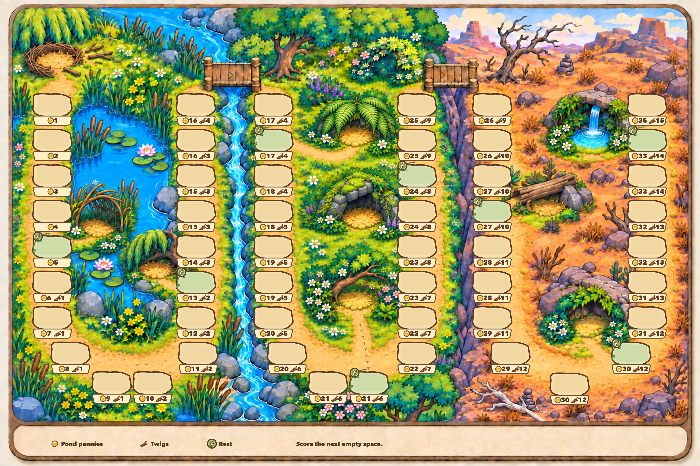

# V4 — nest, icon rewards and visible shelters

Board-only image review. The user accepted the duck and seed tokens; their
existing images remain unchanged. This version keeps the three-biome artwork
and all current reward values while refining the board's visual language.

## Design changes

- An incomplete twig nest replaces the starting dock. Its open bowl is reserved
  for the duck token; no start number, label or generic placement pad covers it.
- All 53 route spaces retain their internal indices, but no index badges are
  printed. The wells share one consistent geometry, including 11, 44 and 53.
- Each bottom row shows a gold coin icon and amount, followed by a twig icon
  and amount. Spaces 1–5 have zero Twigs, so their centered rows show only the
  coin and amount. No P/T abbreviations or zero twig indicators remain.
- Eight green rest wells retain a feather marker and connect to recognizable
  shelters in the adjacent scenery. The log shelter in the wasteland is modest;
  its mossy cave and spring grotto feel more inviting. This is art direction,
  with no additional reward values implied or implemented.
- A matching icon legend and restrained route arrows support reading the board
  after removing the position badges.

## Shelter mapping (internal indices only)

| Space | Shelter |
| --- | --- |
| 5 | Reed arch and grassy pond-side bed |
| 13 | Willow-root hollow on the pond shore |
| 20 | Soft fern bower in the meadow |
| 28 | Flower-covered branch shelter |
| 34 | Mossy stone overhang |
| 40 | Modest log-and-rock shade shelter |
| 46 | Lush stone cave refuge |
| 52 | Small waterfall grotto and oasis |

The nest is separate from the eight daily shelters. Internal start 0, ordinary
encounter positions 1–52, terminal scoring space 53 and the rule to score the
next empty space remain unchanged. Core still has its original 15 ruby flags;
this eight-rest concept does not implement a new rule profile.

## Method and reproduction

Built-in `image_gen.imagegen` edits the generated V3 background. Precise SVG
typesetting with Sharp supplies the wells, icon reward rows, rest markers,
duck-footprint entry markers and legend. The prior user approval for this workflow remains
applicable to the requested revision. The final review image is a 3072 × 2048
JPEG, quality 98 with 4:4:4 chroma sampling.

Run `node render-board.mjs` with Sharp available to Node. The renderer also
supports `--output three-biome-board-v4.png` for a lossless export. The copied
[track data](track-data.json) is unchanged from the independently verified
[V3 source audit](../2026-09-11-v3/track-data.md).

Prompts: [initial nest/shelter edit](background-prompt.json),
[shelter alignment](alignment-prompt.json),
[meadow shelter refinement](shelter-refinement-prompt.json).

[Static QA](typeset-qa.json) records 53 internal anchors and exact reward rows,
five zero-Twig omissions, eight rests and entry trails, consistent geometry at
11/44/53, and no pad bounds or overlap failures. The exported image is also
visually reviewed; these checks do not establish runtime behavior.
[Native artwork provenance](background-inspection.json) and
[final inspection](final-inspection.json) preserve the source and output hashes.
The revised brief/data checkpoint is `d5aebab`; native artwork is `d4523f5`;
the final renderer, image and QA are `a66c8d3`.

No Unity import, Editor call, gameplay change or device test is part of this
pass. Stop for the user's board review before further work.
