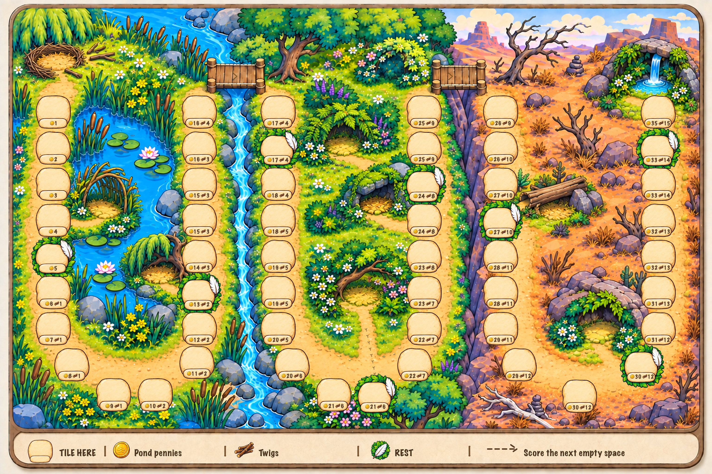

# V5 — painted bubbly spaces and illustrated legend

This is a board-only image review. The user preferred the first nest/shelter
background, with its oasis in the far upper right, and the bubbly spaces and
full illustrated footer of the earlier generated labelled-board attempt.
V4's flat, repeated well shapes and compact legend are superseded as style.

## Chosen direction

- Keep [the selected background](board-art-v5.png) unchanged: incomplete nest,
  eight scenic shelters, both bridges and the far upper-right oasis.
- Build the 53 spaces from painted cream stone components with bubbly contours,
  warm edge shading and subtle variations. Use full leafy borders with a large
  white feather on the eight rest spaces.
- Typeset the verified rewards into the painted bottom capsules. Use coin/twig
  icons and amounts; zero-Twig rows show only the centered coin pair. Position
  indices remain internal, with no start label or SCORE badge.
- Restore the large illustrated lower-border key: empty stone and TILE HERE,
  coin and Pond pennies, twig bundle and Twigs, leafy feather and REST, then a
  dashed arrow and Score the next empty space. Vertical separators organize it.

The exact current reward table, internal start 0, route spaces 1–53 and eight
rest indices 5,13,20,28,34,40,46,52 are retained. Ordinary encounter placement
ends at 52; 53 remains the terminal scoring space. The eight-rest image concept
does not alter Core's original 15 ruby flags or implement a biome reward curve.
Approved token images remain unchanged.

## References and method

[Reference provenance](references.json) records both images selected by the
user. The [earlier labelled board](bubbly-style-reference.png) is a style
reference only: its numbering and rewards remain inaccurate and are not used
as data. [Track data](track-data.json) is copied from the verified V3 audit.

Built-in `image_gen.imagegen` produced the [native painted kit](painted-kit-native.png)
from the [painted-kit prompt](painted-kit-prompt.json). It returned a painted
checker background rather than an alpha channel; the
[background-extraction retry](transparent-kit-prompt.json) was also opaque.
For the chosen static compositing workflow, [extract-painted-kit.mjs](extract-painted-kit.mjs)
isolates the nine painted components as [an RGBA atlas](painted-kit.png).
The [extraction inspection](painted-kit-inspection.json) verifies unchanged RGB,
opaque cream/feather artwork, transparent gutters and complete sprite bounds.
The generated native input is retained unchanged.

The static renderer composites these painted sprites over the chosen background
and adds exact typography. It does not redraw the well shapes as flat SVG.
Prompts, input images, extraction and layout remain reproducible outside Unity.
No editor calls, imports, gameplay changes or device tests are included.

## Reproduction and verification

Run `node extract-painted-kit.mjs` to reproduce the RGBA component atlas, then
`node render-board.mjs` to export the board. Both use Sharp. The local macOS
render uses Marker Felt lettering; matching fonts are required to reproduce
the same text appearance on another machine. No system font files are included.
Use `--output three-biome-board-v5.png` for a lossless export instead of the
3072 × 2048 quality-98 JPEG with 4:4:4 chroma sampling.

[Atlas metadata](tile-atlas-v5.json) records the nine complete sprite crops.
[Static QA](typeset-qa.json) records all 53 internal positions and exact reward
rows, five zero-Twig omissions, eight rest positions, bounds and crop checks.
Marker Felt numeral glyph bounds and bearings are measured at 11px, and every
reward group fits inside a 6px horizontal / 3px vertical inner-capsule inset.
The final board and close-ups of 53, 52/51, 44 and 1 were visually inspected.
[Final inspection](final-inspection.json) records output hashes, source
preservation and the pending user review; static checks do not establish Unity
runtime or device behavior.

The revised brief/reference checkpoint is `f05432f`; the painted kit and
extraction evidence are `cd32631`; the final board/renderer/QA are `db76c1c`.
Stopped for the user's image review before further work.
