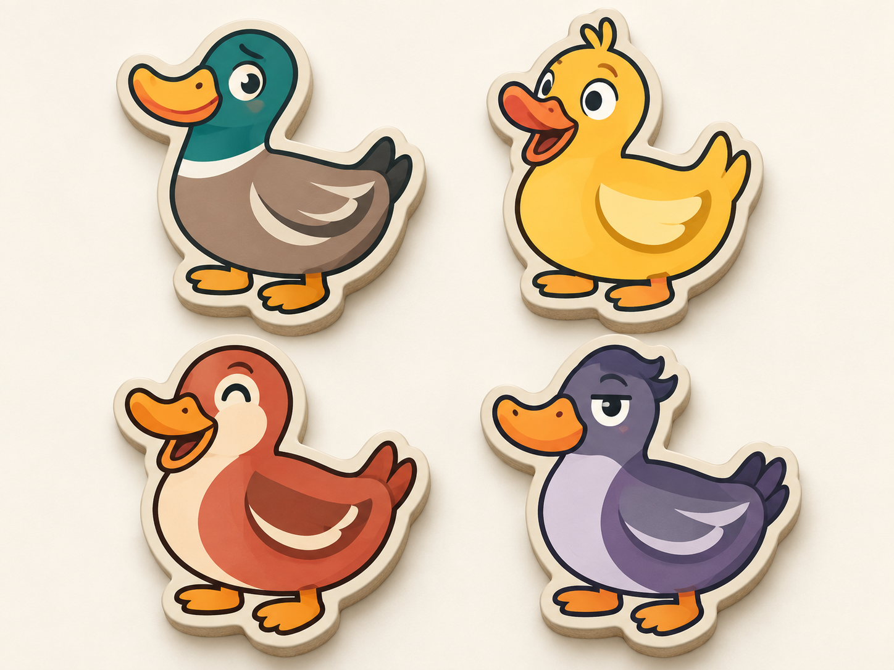
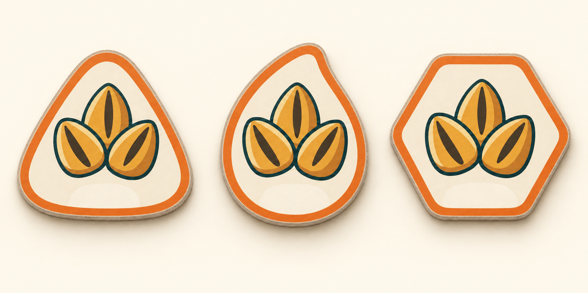
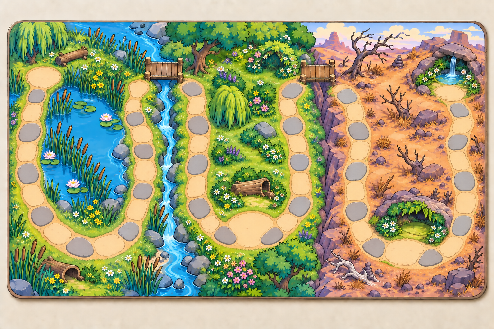

# Tabletop duck concepts — 11 September 2026

The revised M1 image review is ready. These three selected images explore the
user's tabletop direction following rejection of the first Unity style test.
They are saved outside Unity; no import, Editor operation or game change was
performed. The plan revision is published in `d0ac497`.

## Player duck tiles

Four physical-looking die-cut tiles with distinct colours, faces and head
shapes: mallard, yellow, coral and violet. The supplied duck informed the goofy
proportions; the generated sheet develops an original family of player pieces.
Four identities are a visual study, not a change to the human-versus-AI setup.

## Seed encounter tile shapes

Rounded triangle, seed silhouette and rounded hexagon are alternatives for the
same seed category. A blank lower area leaves room for a future strength label;
the study introduces no new values or powers. The final refinement gives all
three tiles a clean opaque background and consistent cardboard edges.

## Illustrated board

A single path travels through three open bends, joined by two bridges: pleasant
pondside grassland, an abundant meadow, then an exposed wasteland with rare
cosy refuges. Irregular stones and clearings belong to the board illustration.
The final correction opens the pond route so the upper-left clearing is its
start, rather than a closed circuit. The route ends by the sheltered spring.

The concept communicates the proposed reward pattern: modest early rewards,
better middle-region rests, then poor ordinary stops with exceptional refuges
late on. It does not assign numbers or settle scoring rules. Exact 54-position
mapping, shelter designation, tablet-size readability and balance remain later
design/implementation work. The existing game rules are unchanged.

## Files and provenance

| Selected image | Native dimensions |
| --- | --- |
| `duck-player-tiles-v2.png` | 1448 × 1086 |
| `seed-tiles-v2.png` | 1774 × 887 |
| `three-biome-board-v2.png` | 1536 × 1024 |

All were generated using the built-in `image_gen.imagegen` tool and copied here
without resizing or manual raster editing. There were three initial generation
calls and three targeted refinement calls: seed background cleanup, board route
clarification and opening the pond loop. Only selected final images are tracked;
the initial generated outputs remain in the local generation folder.

- [Initial prompts](prompts.json)
- [Seed and board refinement prompts](refinement-prompts.json)
- [Final board correction prompt](board-correction-prompt.json)
- [Output paths, dimensions, hashes and inspection](inspection.json)
- [Current plan](../../PLAN.md) and [art brief](../../ASSET_BRIEF.md)

Stopped here for the user's image review. No Unity import or next milestone is
authorized by completion of this concept pass.
