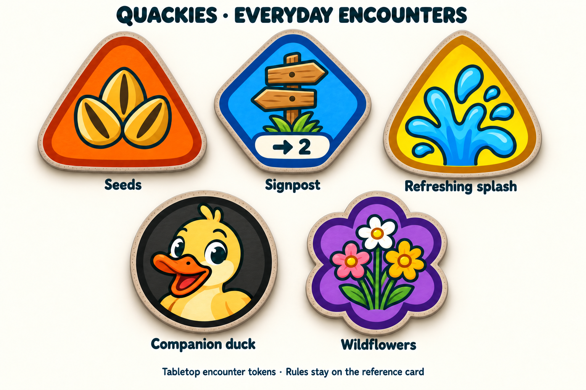
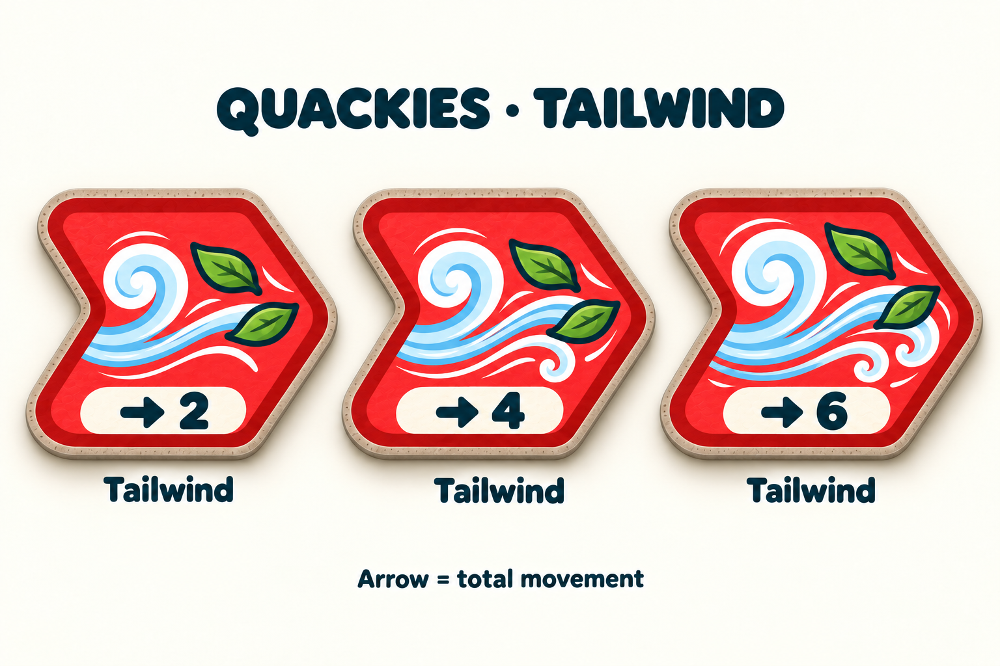
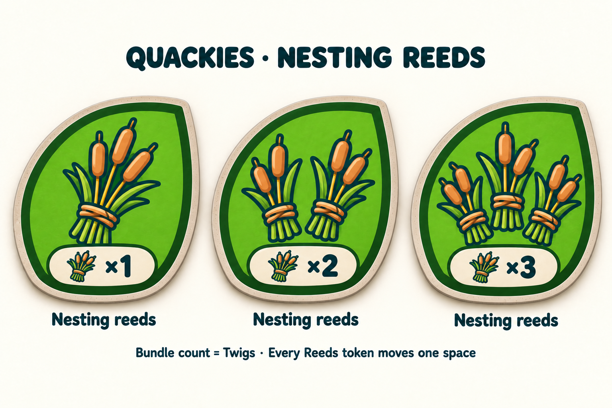
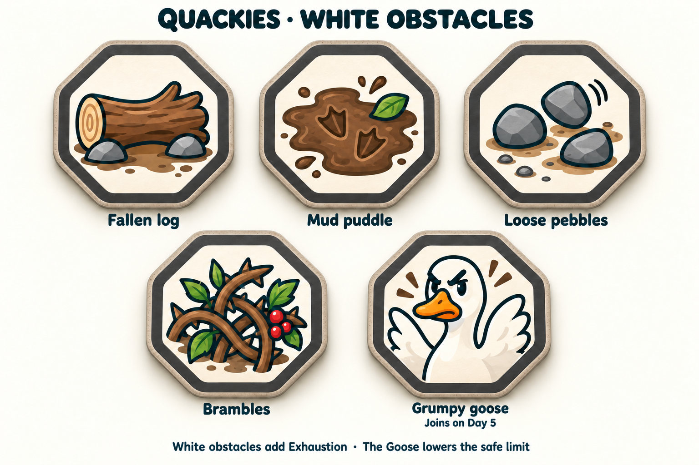

# Current Quackies token set

Generated 13 September; approved by the user 14 September 2026. Four concept sheets cover all **16 encounter designs and
variants** in the accepted first ruleset. They preserve the approved colourful
cartoon/cardboard style and category silhouettes. The rules are summarized in
[RULES_AT_A_GLANCE.md](../../RULES_AT_A_GLANCE.md); details and later alternatives
remain in [ENCOUNTER_RULES.md](../../ENCOUNTER_RULES.md).

## Everyday encounters

Five designs: plain orange Seeds; blue Signpost with explicit →2; yellow
Refreshing splash; black Companion disc; purple Wildflowers. No generic ‘1’
badges, Seed ability icons or Companion shields. Companion uses one face because
its 2/3/4 movement comes from the active flock that Day (after any Mud losses).

## Tailwind movement variants

Three matching red chevrons with clear →2, →4 and →6. Each arrow denotes the
token's total movement before modifiers, not an extra amount added to one.

## Reeds quantities

Three matching green leaf tokens with one/two/three tied bundles and a matching
bundle symbol ×1/×2/×3. All have normal movement one; the quantity grants Twigs
even when worn out under the 14 September reward rule. It never represents extra chips, placements or movement.

## White obstacles

Five matching white/charcoal octagons. Goose now says “Joins on Day 5”; the old
optional label and blanket “Five is safe” footer are removed. There are no
movement or Exhaustion numerals on the faces.

The accepted [player duck tiles](../2026-09-11/duck-player-tiles-v2.png) remain
unchanged and distinct from the round Companion encounter. This set introduces
no new player identities, resource currencies or board design.

## Provenance and limits

Generated with built-in image_gen, using the earlier approved family sheets as
references. The complete [prompt set](prompts.json) records every input and
constraint. [Inspection](inspection.json) records native source paths, hashes,
dimensions and visual findings. All four PNGs are 1536 × 1024 RGB and were copied
byte-for-byte to this folder. Root inspected every token, label and numeric mark.

These are opaque review sheets, not isolated transparent sprites, exact-size
iPad validation or a Unity import. Production symbols/state still need precise
overlays and verified sizing. Current powers are agreed for a first test; the
new [table/prices](../../v1/BOARD_AND_SHOP.md) and [events](../../v1/WORLD_EVENTS.md)
are separate review proposals, not instructions encoded in the artwork. Prior approved source images remain unchanged.
