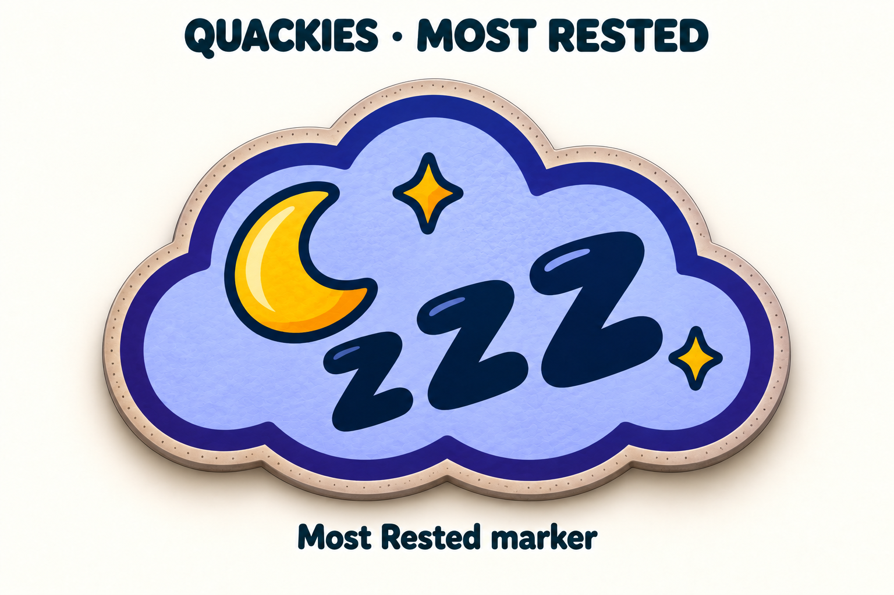

# Most Rested marker concept

14 September 2026. New design proposal for the user-requested transferable
Most Rested tile. The approved encounter artwork is unchanged.

A lavender cloud, dark blue rim, crescent and readable “zzz” distinguish this
award from permanent Feathers and from encounter chips. On Days 2–10, display it
on the one extra start space beyond the current Feather trail. Resolve Dawn
Delivery first so the marker sits beyond the updated trail. The advantage lasts
one Day; pass the award after the next Night comparison. Tied eligible winners
retain equal benefits using duplicated display markers/shared ownership.
Night 10 awards a Dream Twig instead; it does not imply a Day 11.

The native 1536 × 1024 opaque sheet was generated with built-in image_gen using
the approved everyday encounter sheet as a style reference, visually inspected,
and copied unchanged. See [prompt](prompts.json) and [inspection](inspection.json).
This is a review concept, not a production sprite or Unity import. Footprint,
transparent isolation and iPad readability will be checked during production.
