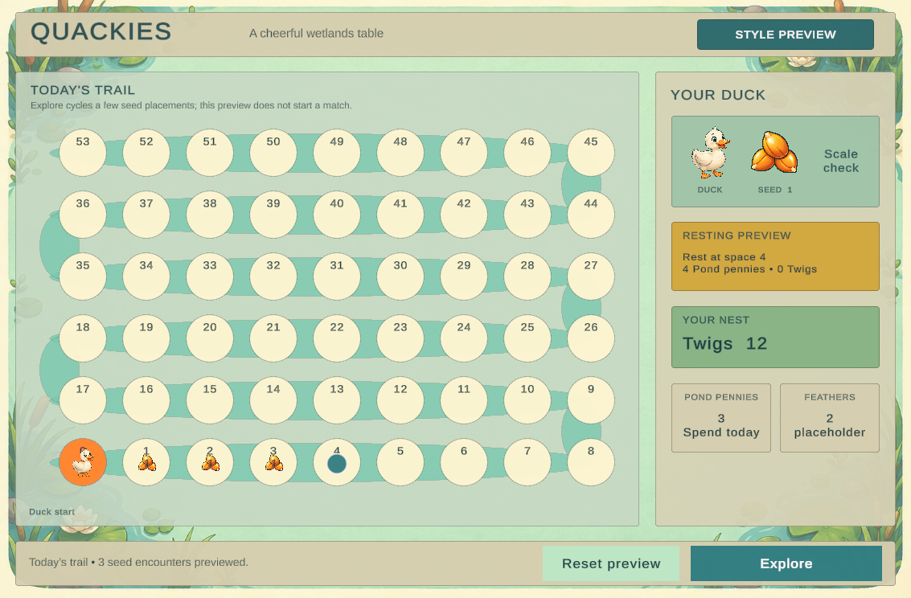

# M1 Unity style review evidence

Captured 10 September 2026 at 16:09:19 UTC. Art checkpoint `ff2c41b`; Unity
scene/source checkpoint `42e51b3`. This is the isolated style preview, using fixed
visual examples. It does not create a MatchSession or run the full game.

## Reopen

Open `unity/Quackies.Unity` with Unity 6000.6.0f1. From Edit mode choose
**Quackies → Build and Play Duck Style Test**. The builder creates
`Assets/Scenes/DuckStyleTestScene.unity`; repeated construction replaces its
objects. Explore cycles examples and Reset restores the first. The existing
playable scene remains available through **Build and Play Initial Scene**.

## Checks and limits

| Check | Result |
| --- | --- |
| Unity compilation and console | Completed, failed=false; no messages in the final captured console |
| Actual GameView target | 1133 × 744, matching the 2266 × 1488 iPad mini aspect |
| Native screenshot | PNG dimensions independently confirmed as 1133 × 744; no resizing |
| Complete track | 54 unique cells 0–53, five alternating rounded bends, no duplicates after two builds |
| Final geometry | 66 code-native ellipses; 14pt board indices |
| Runtime layout | All 54 cell bounds inside the viewport; zero TMP text overflows after forced canvas/text updates |
| Explore | Real EventSystem raycast hit and pointer callback; 3 seeds/rest space 4 became 5 seeds/rest space 6 |
| Reset | Restored 3 seeds/rest space 4; duck space 0 and nest Twigs 12 unchanged |
| Resting rewards | Read from Core's next scoring space, separate from the fixed nest score |
| Preservation | Core, CLI, tests, Core DLL, raw art, original scene and shipping build list unchanged from M0 |
| Existing local settings | Preloaded-assets removal retains its recorded M0 hash and remains uncommitted |

The target size was read from `PlayModeView.GetMainPlayModeView().m_TargetTexture`;
the connector's `Screen.width/height` can report the focused Editor GUI surface.
The final native image was visually reviewed for the full trail, rounded joins,
duck/seed scale, labels and controls. User feedback on the style is pending.

This is Editor and visual-preview evidence. There was no new full-match run,
iOS export, physical-device test or rule change in M1. The last Core baseline
was 129 passing tests in M0; those tests were not repeated for this isolated art
and presentation change. More artwork and M2 terminology remain future work.

## Durable records

- [Unity QA](unity-qa.json): final worker check record, copied unchanged from
  `Assets/Temp/DuckStyleM1/m1-qa.json`.
- [Checkpoint inspection](checkpoint-inspection.json): source/scene, screenshot
  and QA SHA-256 hashes, asset and baseline preservation checks.
- [Asset inspection](asset-inspection.json): native sizes, alpha and original
  output hashes; [manifest](../../ASSET_MANIFEST.md) lists saved Unity paths.
- [Exact generation prompts](../../m1-image-prompts.json): three bounded
  built-in image-generation calls.

The native screenshot was copied unchanged from
`Assets/Temp/DuckStyleM1/duck-style-final-native.png`. The preview was left in
Play mode at reset. Pause for the user's reaction before starting M2.
